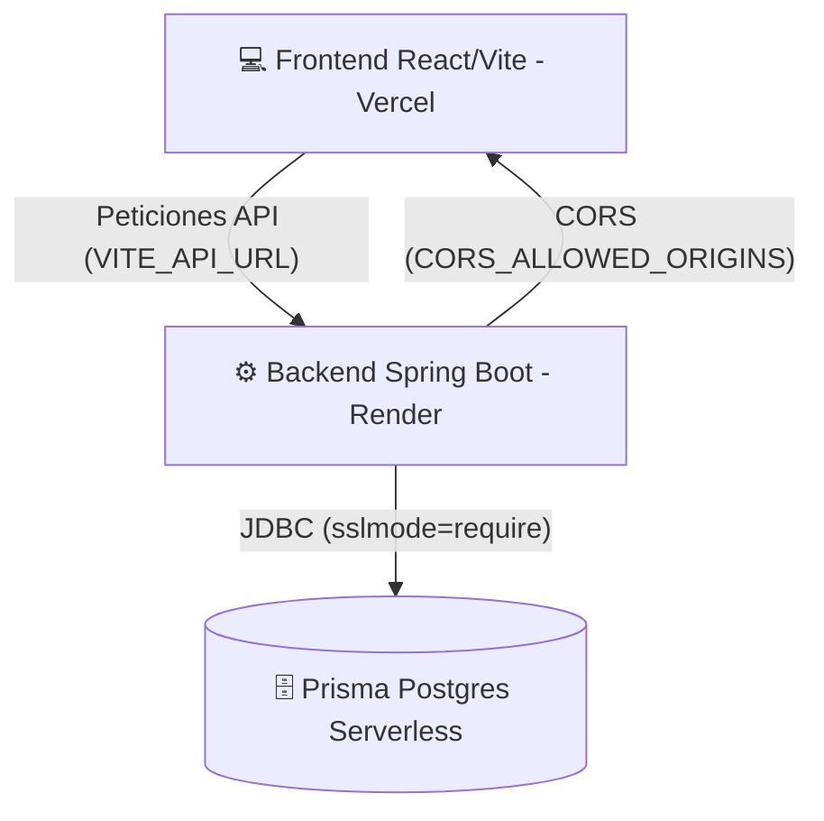

# 🚀 Guía de Despliegue Premium - EduPerformance

Esta guía te guiará paso a paso para desplegar con éxito la arquitectura de **EduPerformance**: el **Backend (Spring Boot)** en **Render** y el **Frontend (React + Vite)** en **Vercel**, conectándolos de manera fluida a tu base de datos de **Prisma Postgres Serverless**.

---

## 📋 Arquitectura de Despliegue

---

## 🛠️ Requisitos Previos

1. Tener una cuenta en [GitHub](https://github.com).
2. Tener una cuenta en [Render](https://render.com).
3. Tener una cuenta en [Vercel](https://vercel.com).
4. Subir la carpeta raíz completa (`EduPerformance-Entrega-Final`) a un repositorio **privado o público** en GitHub.

---

## 📦 PASO 1: Despliegue del Backend en Render

Tienes **dos métodos** para desplegar el backend en Render. El método Blueprint (Infraestructura como Código) es el más rápido y automatizado.

### Método A: Despliegue Automático con Render Blueprints (Recomendado ⚡)

Este método lee el archivo `render.yaml` que hemos configurado para crear y configurar todo con un par de clics:

1. Ve a tu panel de **Render** e inicia sesión.
2. Haz clic en **Blueprints** en la barra superior (o ve a `https://dashboard.render.com/blueprints`).
3. Haz clic en **New Blueprint Instance**.
4. Conecta tu repositorio de GitHub donde subiste el proyecto.
5. Render detectará automáticamente el archivo `render.yaml` y te mostrará los servicios a crear:
   - **Service Name:** `eduperformance-backend`
   - **Environment Variables:** Las variables ya vendrán pre-configuradas con tus credenciales de Prisma actualizadas.
6. Haz clic en **Approve** (o **Apply**).
7. ¡Listo! Render compilará la imagen de Docker usando el `Dockerfile` de forma automática.
8. Una vez desplegado, copia la URL que te proporciona Render (tendrá un formato similar a `https://eduperformance-backend.onrender.com`).

---

### Método B: Despliegue Manual como Web Service (Alternativa 🛠️)

Si prefieres configurarlo manualmente desde la interfaz de Render:

1. En el panel de Render, haz clic en **New +** y selecciona **Web Service**.
2. Conecta tu repositorio de GitHub.
3. Configura los siguientes parámetros en el formulario:
   - **Name:** `eduperformance-backend`
   - **Region:** Selecciona la más cercana a ti (ej. *Oregon (US West)* o *Ohio (US East)*).
   - **Branch:** `main` (o la rama donde esté tu código).
   - **Root Directory:** `EduPerformanceBack` *(¡Muy importante!)*
   - **Runtime:** `Docker` *(¡Muy importante! Selecciona Docker para usar el Dockerfile multi-etapa optimizado)*.
   - **Instance Type:** `Free` (o el plan que desees).
4. Despliega hacia abajo y haz clic en **Advanced**. Agrega las siguientes **Environment Variables**:

| Variable | Valor | Descripción |
| :--- | :--- | :--- |
| `PORT` | `8080` | Puerto en el que escuchará el contenedor. |
| `SPRING_DATASOURCE_URL` | `jdbc:postgresql://pooled.db.prisma.io:5432/postgres?sslmode=require&prepareThreshold=0` | URL de conexión JDBC. |
| `SPRING_DATASOURCE_USERNAME` | `6a3956b34fe807c585ae837087c7ccd13b583b1fa63ca5b809925e0b9d7109fb` | Nuevo usuario de tu base de datos de Prisma. |
| `SPRING_DATASOURCE_PASSWORD` | `sk_jCoAE-TUeiGkOmZd-9F0W` | Nueva contraseña de tu base de datos de Prisma. |
| `APP_URL` | *(La URL que Render te asigne al final)* | Ejemplo: `https://eduperformance-backend.onrender.com` |
| `CORS_ALLOWED_ORIGINS` | `http://localhost:5173` | Permite orígenes locales inicialmente. *(Luego lo actualizaremos con la URL de Vercel)*. |

5. Haz clic en **Create Web Service**.

---

## 💻 PASO 2: Despliegue del Frontend en Vercel

Vercel detectará que es un proyecto React + Vite y lo compilará al instante:

1. Ve a tu panel de **Vercel** e inicia sesión.
2. Haz clic en **Add New...** y selecciona **Project**.
3. Importa tu repositorio de GitHub.
4. En la configuración del proyecto (**Configure Project**):
   - **Framework Preset:** Selecciona **Vite** (suele auto-detectarse).
   - **Root Directory:** Haz clic en *Edit* y selecciona **`EduPerformanceFront`** *(¡Crucial para que compile el front en lugar del root!)*.
5. Abre la sección de **Build and Development Settings** (deja los valores por defecto: `npm run build` y directorio de salida `dist`).
6. Abre la sección **Environment Variables** y agrega la siguiente variable de entorno:

| Nombre de Variable | Valor |
| :--- | :--- |
| `VITE_API_URL` | `https://TU-BACKEND-DE-RENDER.onrender.com/api` |

*(Asegúrate de reemplazar `https://TU-BACKEND-DE-RENDER.onrender.com` con la URL real de tu Web Service de Render que copiaste en el Paso 1. Debe terminar en `/api`)*.

7. Haz clic en **Deploy**.
8. Una vez finalizado el despliegue, Vercel te dará una URL de producción (por ejemplo: `https://edu-performance-front.vercel.app`). **Copia esta URL**.

---

## 🔄 PASO 3: Enlazar el Backend con el Frontend (Seguridad CORS)

Para que el backend acepte peticiones desde el frontend desplegado en Vercel, debemos actualizar los orígenes de CORS permitidos:

1. Ve al panel de **Render** y selecciona tu Web Service `eduperformance-backend`.
2. Ve a la pestaña **Environment** en el menú izquierdo.
3. Busca la variable **`CORS_ALLOWED_ORIGINS`**.
4. Modifica su valor agregando la URL de Vercel que copiaste en el Paso 2, separada por coma si deseas mantener localhost para pruebas locales:
   - **Ejemplo de Valor:** `http://localhost:5173,https://edu-performance-front.vercel.app`
5. Haz clic en **Save Changes**.
6. Render redesplegará automáticamente tu backend en segundos para aplicar la nueva política de seguridad.

---

## 🔥 PASO 4: Siembra Automática de Datos de Prueba (Seeding)

¡Buenas noticias! Tu backend de Spring Boot incluye un **sembrador de datos automático** (`DataSeeder`).
- Al iniciar el backend conectado a tu base de datos de Prisma vacía, detectará que no existen registros y sembrará automáticamente las cuentas y datos de prueba premium:
  - **Administrador:** `sofia.altamirano@edu.com` / contraseña: `admin123`
  - **Profesor:** `carlos.mendoza@edu.com` / contraseña: `profesor123`
  - **Estudiante 1:** `ana.silva@edu.com` / contraseña: `estudiante123`
  - **Estudiante 2:** `mateo.lopez@edu.com` / contraseña: `estudiante123`

---

## 🧪 PASO 5: Verificación del Funcionamiento

1. Abre la URL de tu frontend en Vercel.
2. Intenta iniciar sesión con las credenciales de administrador (`sofia.altamirano@edu.com` / `admin123`).
3. Si la base de datos está en línea y conectada, iniciarás sesión exitosamente y verás el dashboard premium con datos de cursos, calificaciones y asistencia ya cargados.
4. Para ver la documentación interactiva de tu API (Scalar API / Swagger), abre en tu navegador:
   - `https://TU-BACKEND-DE-RENDER.onrender.com/swagger-ui.html`
   - O la interfaz moderna de Scalar: `https://TU-BACKEND-DE-RENDER.onrender.com/`
